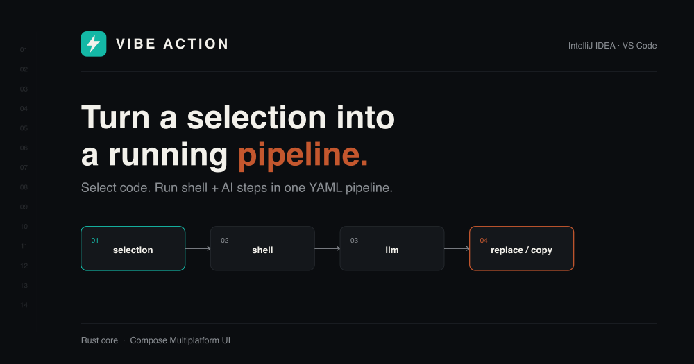
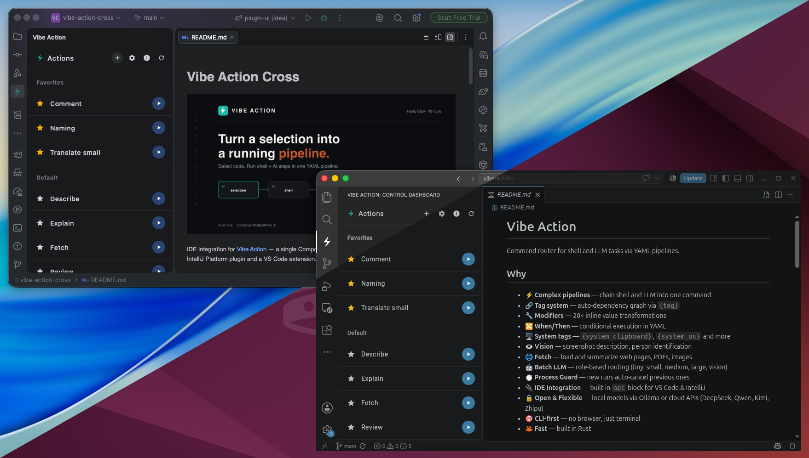

# Vibe Action Cross



IDE integration for [Vibe Action](https://vibe-action.keygenqt.com/) — a single Compose Multiplatform UI,
shipped natively as both an IntelliJ Platform plugin and a VS Code extension.

Vibe Action itself works standalone via clipboard + OS tasks/external tools — no plugin required.
This project exists to remove that friction: instead of memorizing keybindings or hand-editing `tasks.json`/`External Tools.xml`,
you get a native panel inside the IDE that discovers available flows (built-in and custom YAML) and runs them with visible feedback.

## Why

- **Discovery** — see all available actions, including custom YAML flows, without configuring anything per-project
- **Feedback** — know what's happening while a flow runs, instead of waiting on a system notification
- **Native everywhere** — Jewel-themed inside IntelliJ, VS Code-themed inside its webview; same UI code, no visual mismatch with either host

## Requirements

- [`vibe-action`](https://crates.io/crates/vibe-action) CLI installed and available on `PATH`

## Architecture

One Kotlin Multiplatform / Compose Multiplatform codebase targets two hosts:

- **IntelliJ Platform Plugin** — Compose rendered via `ComposePanel` inside a Swing tool window, Jewel-themed
- **VS Code Extension** — same UI compiled to JS/Wasm, rendered inside the extension's webview

Platform-specific behavior (process execution, native dialogs, resources) goes through a `Bridge`, not `if`/`else`
branching in shared code. See [`cmp-ide-cross`](https://github.com/keygenqt/cmp-ide-cross)
for the architectural writeup this project builds on.

## Preview



## Running the Apps

### IntelliJ Platform Plugin

```bash
./gradlew :plugin-idea:runIde
```

### VS Code Extension

```bash
./gradlew :plugin-ui:webApp:launchVscodeDev
```

## Build IDEA

```bash
./gradlew :plugin-idea:buildPlugin
```

The built plugin artifact (`.zip` or `.jar`) will be placed in `plugin-idea/build/distributions/`.

## Build VSCode

```bash
./gradlew buildExtension
```

The built extension artifact (`.vsix`) will be placed in the `dist/` directory.

## Build All

```bash
./gradlew buildAll
```

Gathers all build artifacts (both IntelliJ and VS Code) into the root `dist/` directory.

## Installation

### VS Code Extension

1. Open VS Code.
2. Go to the Extensions view (`Cmd+Shift+X` or `Ctrl+Shift+X`).
3. Click the `...` menu in the top-right corner of the Extensions panel.
4. Select **Installation from VSIX...**.
5. Navigate to the `dist/` directory and select `vibe-action-0.1.0.vsix`.
6. Reload VS Code when prompted.

Alternatively, install via CLI:
```bash
code --install-extension dist/vibe-action-0.1.0.vsix
```

### IntelliJ Platform Plugin

1. Open IntelliJ IDEA.
2. Go to `Settings/Preferences` -> `Plugins`.
3. Click the gear icon (`⚙️`) in the top-right corner of the Plugins window.
4. Select **Install Plugin from Disk...**.
5. Navigate to the `dist/` directory and select `vibe-action-0.1.0.zip`.
6. Restart IntelliJ IDEA when prompted.
